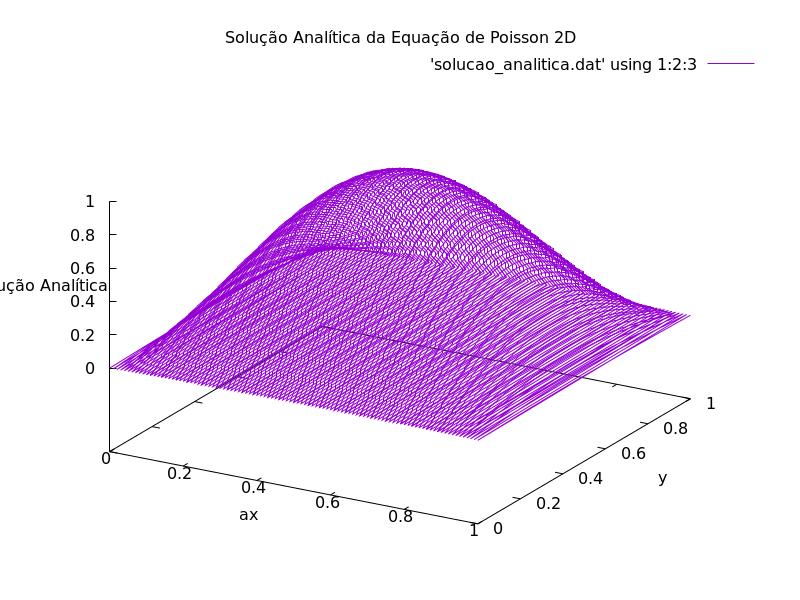

# Solver da Equação de Poisson 2D

## 📑 SUMÁRIO

 1. INTRODUÇÃO
 2. ESTRUTURA DOS ARQUIVOS
 3. INSTRUÇÕES PARA EXECUTAR
 4. REFERÊNCIAS

## 📘 INTRODUÇÃO

A equação de Poisson é um exemplo de EDP (Equação Diferencial Parcial) elíptica bastante conhecida na física e modela alguns problemas importantes, como campos eletrostáticos, gravitação newtoniana e problemas de difusão em estado estacionário. Suas condições de contorno levam a soluções tipicamente suaves. Este código resolve numericamente a equação dada por

$$ \begin{cases}
-\Delta u = f, & \text{em } \Omega,\\
u = g, & \text{em } \partial\Omega.
\end{cases} $$ 

A discretização é feita por diferenças finitas de segunda ordem e o sistema linear que obtemos é resolvido iterativamente via Gauss-Seidel.

---

## 📂 Estrutura dos Arquivos

- **main.c**  
  Implementação do solver da equação de Poisson (discretização, malha, condições de contorno, iterações e cálculo de erro).

- **Makefile**  
  Automatiza:
  - compilação  
  - execução  
  - geração de gráficos  
  - limpeza dos arquivos criados

- **graphic.gp**  
  Script Gnuplot para gerar os gráficos da solução numérica e analítica.

- **verificacao/**  
  Pasta contendo o gráfico de ordem que garante a boa implementação do solver.

---

## 🛠️ INSTRUÇÕES DE EXECUÇÃO

O código está escrito em C, então garanta ter o compilador GCC na sua máquina além do gnuplot para vizualizar as saídas de dados. Estou usando o Makefile que automatiza as etapas. Logo, para compilar, executar e gerar os gráficos dos arquivos "*.dat" criados, apenas dê um
 `make`
 
 Para apagar os arquivos "*.dat" e "*.png" gerados
 `make clean`
 
 Não é necessário nenhuma entrada de valores, o que agiliza testes, mas você
 pode modificar como quiser várias quantidades no início do documento

---

O código irá gerar as soluções analítica e numérica abaixo, 

  
  

---

## 🔗 REFERÊNCIAS

Computational Physics - Nicholas J. Giordano
